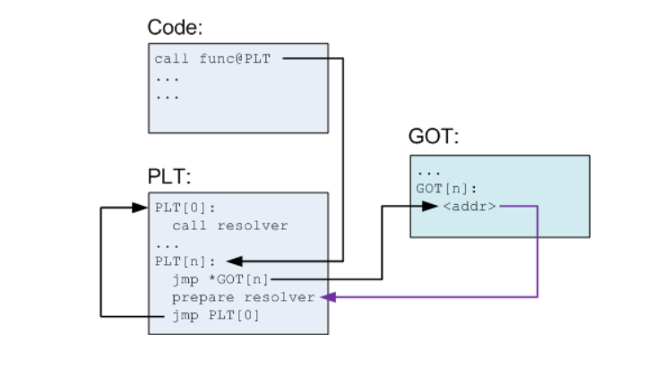
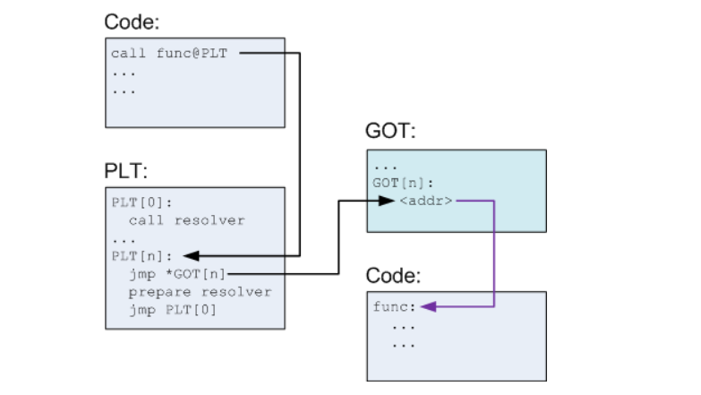

# Ret2dlresolve 
>Trả về hàm `_dl_runtime_resolve` với các tham số được tùy chỉnh nhằm giải quyết bất kì hàm nào trong libc mà chúng ta muốn gọi. 

Tổng hợp ngắn gọn lại các cấu trúc và thuật toán cần fake để thực hiện `ret2dlresolve`, để nắm vững kĩ thuật nên làm ví dụ mẫu, đọc writeup. Tôi sẽ đi từ kiến trúc `32 bit` trước vì nó đơn giản hơn khi khai thác trên kiến trúc này. Trên kiến trúc `64 bit` về cơ bản cấu trúc không thay đổi nhiều, có thay đổi về vị trí, một vài dữ liệu trong cấu trúc, thuật toán kiểm tra dữ liệu. Tôi sẽ viết kỹ hơn khi đề cập đến đó  

## 1) 32 bit.
> Tôi sử dụng kỹ thuật này khi file là 32 bit, ASLR, NX, Partial RELRO, NO PIE và không có Canary. Không xác định được phiên bản `libc` và không có cách nào để `leak` được dữ liệu từ thư viện hay chương trình.

- Khi chương trình gọi hàm từ thư viện lần đầu tiên.



- Những lần gọi hàm sau lần đầu tiên.



Gỡ lỗi chương trình kiểm tra giá trị trên `GOT` khi chưa gọi tới hàm đó - là địa chỉ lệnh thứ hai trong đoạn mã `PLT`.

```asm
pwndbg> disass 'read@plt'
Dump of assembler code for function read@plt:
   0x08048300 <+0>:	jmp    DWORD PTR ds:0x804a00c
   0x08048306 <+6>:	push   0x0
   0x0804830b <+11>:	jmp    0x80482f0
End of assembler dump.
pwndbg> x/wx 0x804a00c
0x804a00c <read@got.plt>:	0x08048306
pwndbg> 
```

Phần .dynamic của tệp ELF chứa thông tin được ld.so sử dụng để phân giải các `symbol` trong thời gian chạy. Chỉ tập trung vào `SYMTAB, STRTAB, và JMPREL`.

```bash
l1j9m4 in ~/Desktop/ret2dlresolve/babystack λ readelf -d babystack | egrep "SYMTAB|STRTAB|JMPREL" 
 0x00000005 (STRTAB)                     0x804822c
 0x00000006 (SYMTAB)                     0x80481cc
 0x00000017 (JMPREL)                     0x80482b0
```

- **JMPREL**

```bash
l1j9m4 in ~/Desktop/ret2dlresolve/babystack λ readelf -r ./babystack

Relocation section '.rel.dyn' at offset 0x2a8 contains 1 entry:
 Offset     Info    Type            Sym.Value  Sym. Name
08049ffc  00000306 R_386_GLOB_DAT    00000000   __gmon_start__

Relocation section '.rel.plt' at offset 0x2b0 contains 3 entries:
 Offset     Info    Type            Sym.Value  Sym. Name
0804a00c  00000107 R_386_JUMP_SLOT   00000000   read@GLIBC_2.0
0804a010  00000207 R_386_JUMP_SLOT   00000000   alarm@GLIBC_2.0
0804a014  00000407 R_386_JUMP_SLOT   00000000   __libc_start_main@GLIBC_2.0
```

>Cấu trúc của các mục nhập loại `Elf32_Rel` là 8 byte và được định nghĩa như sau.

```c
typedef uint32_t Elf32_Addr ; 
typedef uint32_t Elf32_Word ; 
typedef struct 
{
   Elf32_Addr r_offset ; /* Address */ 
   Elf32_Word r_info ; /* Relocation type and symbol index */ 
} Elf32_Rel ; 
#define ELF32_R_SYM(val) ((val) >> 8) 
#define ELF32_R_TYPE(val) ((val) & 0xff)
```

- **STRTAB**

```
pwndbg> x/10s 0x804822c
0x804822c:	""
0x804822d:	"libc.so.6"
0x8048237:	"_IO_stdin_used"
0x8048246:	"read"
0x804824b:	"alarm"
0x8048251:	"__libc_start_main"
0x8048263:	"__gmon_start__"
0x8048272:	"GLIBC_2.0"
0x804827c:	""
0x804827d:	""
pwndbg> 
```

>STRTAB là một bảng đơn giản lưu trữ các chuỗi là tên của `symbol` sẽ được tìm và phân giải ở thư viện liên kết.

- **SYMTAB**

Bảng này chứa thông tin `symbol` có liên quan. Mỗi mục nhập là một cấu trúc Elf32_Sym và kích thước của nó là 16 byte.

```c
typedef struct 
{ 
   Elf32_Word st_name ; /* Symbol name (string tbl index) */
   Elf32_Addr st_value ; /* Symbol value */ 
   Elf32_Word st_size ; /* Symbol size */ 
   unsigned char st_info ; /* Symbol type and binding */ 
   unsigned char st_other ; /* Symbol visibility under glibc>=2.2 */ 
   Elf32_Section st_shndx ; /* Section index */ 
} Elf32_Sym ;
```

>=>Mối liên hệ giữa ba bảng SYMTAB, STRTAB và JMPREL để tính được vị trí tên `symbol` cần tìm và phân giải khi chương trình gọi tới.

```asm
pwndbg> x/4wx 0x80481cc + 1 * 16    // (SYMTAB + index*sizeof(entry)) where index = ELF32_R_SYM(r_info)
0x80481dc:	0x0000001a	0x00000000	0x00000000	0x00000012
pwndbg> x/1s 0x804822c+0x1a
0x8048246:	"read"      // (STRTAB + st_name)
```

Đây là những gì xảy ra khi chương trình gọi đến một hàm của thư viện lần đầu.

```asm
pwndbg> disass 'read@plt'
Dump of assembler code for function read@plt:
   0x08048300 <+0>:	jmp    DWORD PTR ds:0x804a00c
   0x08048306 <+6>:	push   0x0
   0x0804830b <+11>:	jmp    0x80482f0
End of assembler dump.
pwndbg> x/wx 0x804a00c
0x804a00c <read@got.plt>:	0x08048306
pwndbg> x/2i 0x80482f0
   0x80482f0:	push   DWORD PTR ds:0x804a004   // adrgument 1: linkmap of dl_rumtime_resolve() 
   0x80482f6:	jmp    DWORD PTR ds:0x804a008   // dl_rumtime_resolve()
pwndbg> 
```

Toàn bộ thuật toán của quá trình từ mối liên hệ giữa ba bảng SYMTAB, STRTAB và JMPREL để tính được vị trí tên `symbol` cần tìm và phân giải khi chương trình gọi tới.

```c
// call of unresolved read(0, buf, 0x100)
_dl_runtime_resolve(link_map, rel_offset) {
    ...
    // Algorithm
    Elf32_Rel * rel_entry = JMPREL + rel_offset ;
    Elf32_Sym * sym_entry = &SYMTAB [ ELF32_R_SYM ( rel_entry -> r_info )];
    char * sym_name = STRTAB + sym_entry -> st_name ;
    ...
    _search_for_symbol_(link_map, sym_name);
    // invoke initial read call now that symbol is resolved
    read(0, buf, 0x100);
```

### Tóm lại cần fake 

**1.** `Rel_offset`

**2.** `Elf32_Rel->r_info`

**3.** `Elf32_Sym->st_name` 

Để khai thác cần tính toán, lựa chọn vị trí và align phức tạp nữa nên một lần nữa tôi nhấn mạnh đây chỉ giống như `cheat sheet` => đọc và làm ví dụ từ writeup 

## 2) 64 bit.

-----------------------------------------

[+]

[+]

[+]

